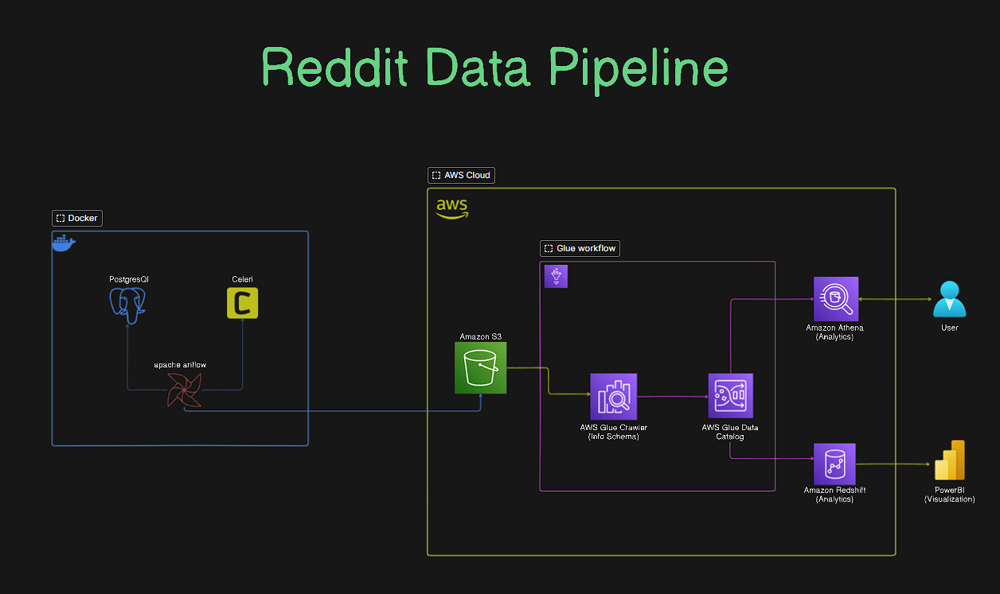

## Reddit Data Pipeline Engineering | AWS End-to-End Data Engineering




### Overview

This project demonstrates a comprehensive end-to-end data engineering pipeline utilizing various AWS services to extract, transform, and load (ETL) data from Reddit. The pipeline is designed to efficiently manage the flow of data from extraction to analysis, leveraging AWS's robust infrastructure and tools.

### Features and Learning Outcomes 📝

1. **Data Extraction from Reddit API**:
   - Learn how to extract data from Reddit using its API.
   - Handle API authentication and data retrieval.

2. **ETL Process with Apache Airflow and Celery**:
   - Set up and orchestrate ETL processes using Apache Airflow.
   - Implement Celery for distributed task management and scheduling.

3. **Efficient Data Storage with Amazon S3**:
   - Store data efficiently in Amazon S3 using Airflow.
   - Manage S3 buckets and objects for optimal storage practices.

4. **Data Cataloging and ETL with AWS Glue**:
   - Utilize AWS Glue for data cataloging and ETL jobs.
   - Create Glue crawlers and jobs to automate data transformation and loading.

5. **Data Querying and Transformation with Amazon Athena**:
   - Query and transform data stored in S3 using Amazon Athena.
   - Leverage SQL queries to analyze and process data.

6. **Data Analytics with Amazon Redshift**:
   - Set up a Redshift Cluster for scalable data warehousing.
   - Follow best practices for loading data into Amazon Redshift for efficient analytics.

### Project Components

- **Data Extraction**: Python scripts to interact with Reddit's API and fetch data.
- **ETL Orchestration**: Apache Airflow DAGs (Directed Acyclic Graphs) to define and schedule ETL workflows.
- **Data Storage**: Configuration of Amazon S3 buckets to store raw and processed data.
- **Data Cataloging**: AWS Glue crawlers and jobs to automate the discovery and transformation of data.
- **Data Querying**: Amazon Athena for running SQL queries on data stored in S3.
- **Data Warehousing**: Setting up Amazon Redshift for data storage and performing complex analytics.

### Getting Started

1. **Clone the Repository**:
   ```bash
   git clone https://github.com/yourusername/reddit-data-pipeline-engineering.git
   cd reddit-data-pipeline-engineering
   ```

2. **Set Up Virtual Environment**:
   ```bash
   python3 -m venv venv
   source venv/bin/activate
   ```

3. **Install Dependencies**:
   ```bash
   pip install -r requirements.txt
   ```

4. **Configure AWS Credentials**:
   Ensure your AWS credentials are configured correctly in your environment. You can use the AWS CLI to configure them:
   ```bash
   aws configure
   ```

5. **Set Up Apache Airflow**:
   Initialize the Airflow database and start the web server:
   ```bash
   airflow db init
   airflow webserver
   ```

6. **Run the Airflow Scheduler**:
   In a separate terminal, start the scheduler:
   ```bash
   airflow scheduler
   ```

7. **Define Airflow Variables and Connections**:
   Set the necessary Airflow variables and connections, including Reddit API credentials, S3 bucket details, and database connections.

8. **Deploy the DAGs**:
   Copy your DAGs to the Airflow DAGs folder and ensure they are correctly picked up by the scheduler.

### Additional Information

- **Logging and Monitoring**:
  Implement logging and monitoring for all ETL processes to ensure reliability and ease of debugging.

- **Error Handling**:
  Incorporate robust error handling mechanisms to manage data extraction failures, network issues, and other potential errors.

- **Scalability**:
  Design the pipeline to be scalable, allowing for increased data volume and complexity over time.

### Conclusion

This project provides a comprehensive guide to building a data pipeline from Reddit to AWS, covering all stages from data extraction to analysis. By following this guide, you will gain hands-on experience with various AWS services and data engineering best practices, preparing you for more complex data engineering challenges.

For further questions or contributions, feel free to open an issue or submit a pull request.

### License

This project is licensed under the MIT License. See the [LICENSE](LICENSE) file for details.